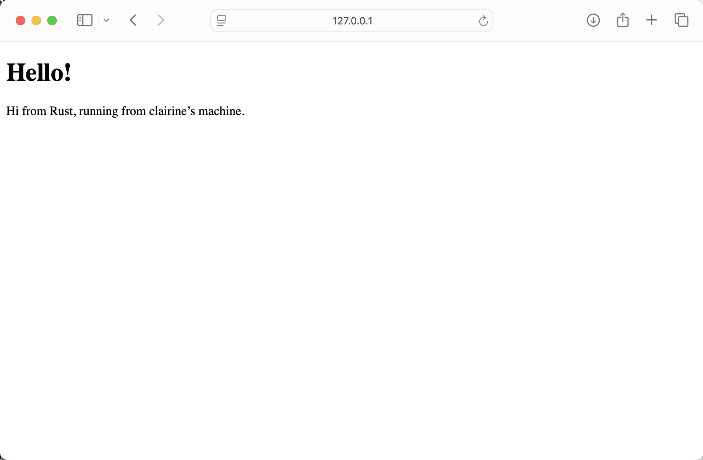
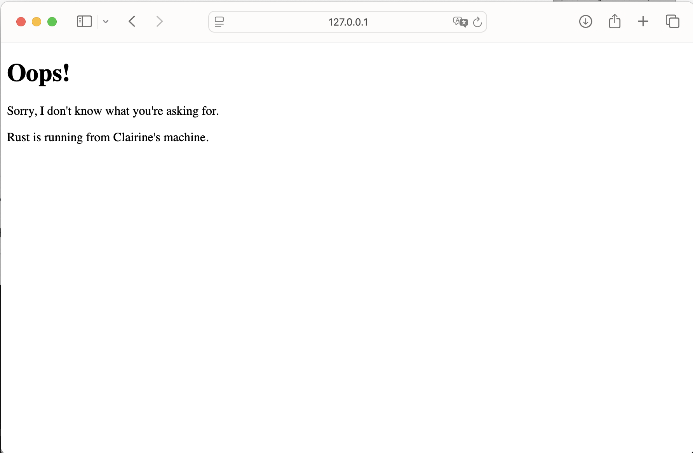
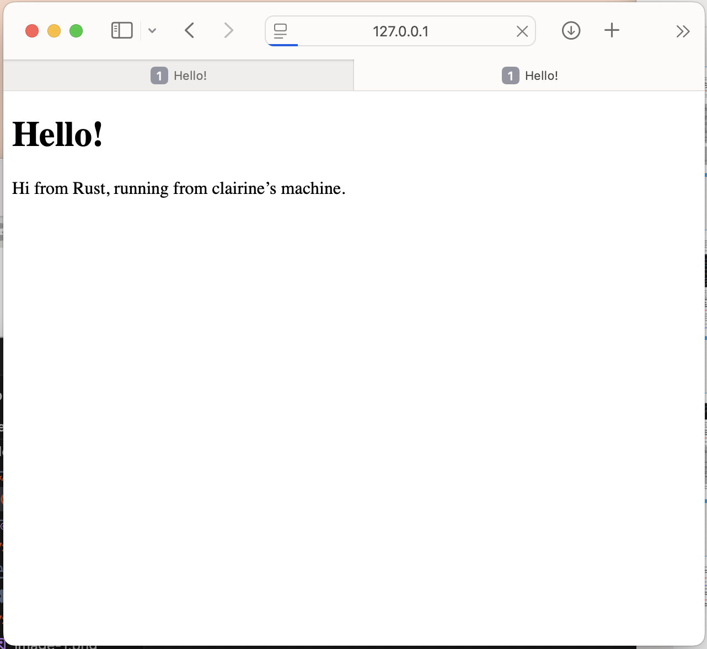
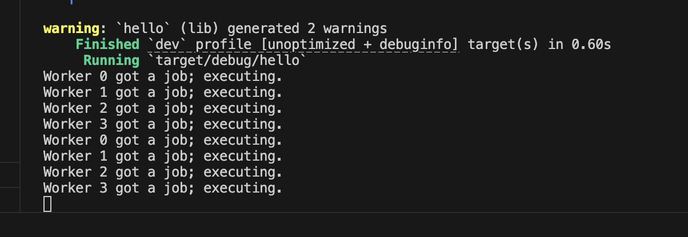

## Commit 1 Reflection notes

Pada Milestone 1 ini, saya mempelajari cara kerja method `handle_connection` yang berfungsi untuk memproses koneksi dari request HTTP. Di dalam method ini, `TcpStream` dibungkus menggunakan `BufReader` untuk meningkatkan efisiensi pembacaan data jaringan melalui mekanisme *buffering*. Setelah itu, method `.lines()` dipanggil untuk membaca aliran data HTTP tersebut baris demi baris. Data yang dibaca kemudian diproses menggunakan `.map(|result| result.unwrap())` untuk langsung mengekstrak nilai string-nya dan mengabaikan penanganan error pada tiap baris. Hal yang paling krusial adalah penggunaan `.take_while(|line| !line.is_empty())`, yang mana bertugas untuk menghentikan proses iterasi pembacaan tepat ketika menemukan baris kosong. Dalam protokol HTTP, baris kosong penanda bahwa bagian *header* dari request telah selesai. Terakhir, method `.collect()` digunakan untuk menggabungkan seluruh baris header yang telah difilter tersebut ke dalam sebuah struktur data `Vec<String>` bernama `http_request` agar bisa dicetak dan dianalisis.

## Commit 2 Reflection notes

Dalam Commit 2 ini, saya telah mengubah kaedah `handle_connection` agar pelayan web dapat mengembalikan fail HTML yang sebenar dan bukannya sekadar memaparkan teks dalam konsol. Pertama, saya menggunakan modul `fs` (file system) untuk membaca kandungan fail `hello.html` secara dinamik ke dalam bentuk String. Baris status HTTP ditetapkan secara eksplisit sebagai "HTTP/1.1 200 OK" bagi menandakan bahawa permintaan klien telah berjaya diproses oleh pelayan. Saiz kandungan fail kemudiannya diukur menggunakan fungsi `.len()` untuk mengisi header `Content-Length`. Header ini sangat penting kerana ia memberitahu pelayar web berapa banyak bait data yang perlu dijangkakan untuk dipaparkan. Seluruh komponen respons HTTP, termasuk baris status, header, dan kandungan fail, digabungkan menjadi satu String yang lengkap menggunakan makro `format!`. Akhir sekali, String tersebut ditukarkan kepada bait data (bytes) dan dihantar semula kepada klien melalui aliran TCP. Dengan perubahan ini, pelayar web kini boleh merender halaman HTML yang saya buat dengan betul.

## Commit 3 Reflection notes

Pada Milestone 3 ini, saya menambahkan fitur validasi request dan routing sederhana pada server. Dengan membaca baris pertama dari request (`request_line`), server kini bisa membedakan apakah pengguna meminta *root path* (`/`) atau path lain yang tidak tersedia. Jika request sesuai dengan `"GET / HTTP/1.1"`, server akan merespons dengan status `200 OK` dan menampilkan `hello.html`. Namun, jika pengguna memasukkan path yang salah, server akan secara otomatis membalas dengan status `404 NOT FOUND` dan merender halaman `404.html`. 

Proses *refactoring* sangat krusial dilakukan di tahap ini karena sebelumnya kode untuk membaca file dan menyusun respons HTTP terduplikasi di dalam blok `if` dan `else`. Dengan melakukan refactoring, saya mengekstrak variabel `status_line` dan `filename` ke dalam tuple, sehingga logika pengiriman respons cukup ditulis satu kali di bagian akhir method. Hal ini selaras dengan prinsip *Clean Code* (DRY - Don't Repeat Yourself), yang membuat kode menjadi lebih rapi, mudah dibaca, dan meminimalisir potensi bug jika nantinya ada perubahan format respons HTTP.

## Commit 4 Reflection notes

Pada Milestone 4 ini, saya menyimulasikan respons lambat (*slow response*) dengan menambahkan *routing* baru, yaitu `/sleep`. Ketika *endpoint* tersebut diakses, server diprogram untuk menjalankan instruksi `thread::sleep(Duration::from_secs(10))`, yang membuat *thread* utama tertidur atau berhenti sejenak selama 10 detik sebelum akhirnya merender file HTML. Melalui eksperimen membuka dua jendela *browser* (satu mengakses `/sleep` dan yang lainnya mengakses `/`), saya mengamati bahwa jendela kedua tidak langsung menampilkan hasil. Jendela kedua terus mengalami *loading* dan harus menunggu sampai proses di jendela pertama selesai menghabiskan waktu tidurnya selama 10 detik. Hal ini terjadi karena arsitektur server yang saya bangun saat ini masih bersifat *single-threaded*, di mana server hanya bisa menangani satu koneksi pada satu waktu secara berurutan (*sequential*). Saat server sedang sibuk menahan request `/sleep`, seluruh request lain yang masuk akan diblokir dan dimasukkan ke dalam antrean hingga *thread* tersebut kembali bebas. Simulasi ini memberikan gambaran nyata mengenai hambatan kinerja (*bottleneck*) pada server *single-threaded*, sekaligus menjadi motivasi utama mengapa implementasi *multithreading* (seperti *Threadpool*) sangat dibutuhkan untuk menangani banyak koneksi secara bersamaan.

## Commit 5 Reflection notes

Pada Milestone 5 ini, saya berhasil mengatasi masalah *bottleneck* dari simulasi *slow request* dengan menerapkan arsitektur *Multithreaded Server* menggunakan `ThreadPool`. Alih-alih membuat *thread* baru secara tak terbatas yang berisiko menghabiskan sumber daya sistem, saya membatasi jumlah *thread* yang aktif menjadi 4 *workers*. Untuk mendistribusikan pekerjaan dari *thread* utama ke para *workers*, saya menggunakan mekanisme *message passing* dengan *channel* `mpsc` (Multiple Producer, Single Consumer). Karena *receiver* dari *channel* ini harus dibagikan ke banyak *workers*, saya menggunakan `Arc` (Atomic Reference Counting) untuk *shared ownership* yang aman antar *thread*. Saya juga membungkusnya dengan `Mutex` guna memastikan bahwa hanya ada satu *worker* yang dapat mengunci dan mengambil pesan (pekerjaan) dari antrean pada satu waktu. Berkat arsitektur ini, ketika ada request lambat di *endpoint* `/sleep`, request tersebut hanya akan menahan satu *worker*, sehingga server tetap responsif melayani koneksi masuk lainnya secara bersamaan.